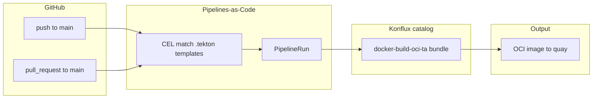

# Application: `coffee`

Konflux **Application** grouping for coffee-related images and tests: **components**, the **build pipeline contract**, and **integration** verification.

## Components

| Component | Source + build context | Image repository (example) |
|-----------|-------------------------|------------------------------|
| **coffee-break** | `applications/coffee/components/coffee-break/` (`Containerfile`, `src/`) | `quay.io/redhat-user-workloads/<tenant>/coffee/coffee-break:<tag>` |

Cluster source of truth is the **Component** CR; Git carries `component.yaml` next to the source for review and alignment.

## Pipeline flow

1. **Triggers (PaC)** — Only manifests under **repository root** `.tekton/` are considered.  
   - **Push:** `.tekton/coffee-break-on-push.yaml` when branch is `main` and relevant paths change (component tree, repo pipeline YAML, or the PaC file).  
   - **PR:** `.tekton/coffee-break-on-pr.yaml` for pull requests targeting `main` with the same path rules.

2. **Executor** — PaC starts a `PipelineRun` that references the **`docker-build-oci-ta`** Tekton bundle (clone/fetch, build with **trusted artifacts**, push). Parameters `path-context` and `dockerfile` must stay aligned with `applications/coffee/pipelines/coffee-break-pipeline.yaml` and `component.yaml`.

3. **Repo pipeline YAML** — `pipelines/coffee-break-pipeline.yaml` documents the same contract (clone → buildah on `applications/coffee/components/coffee-break` → push) for traceability and optional direct `PipelineRun` use; it is **not** moved under the component folder per repo conventions.

4. **Integration** — After a snapshot is produced, Konflux can run `integration/verify-hello.yaml` via an **IntegrationTestScenario** (see `integration/IntegrationTestScenario.example.yaml`).
